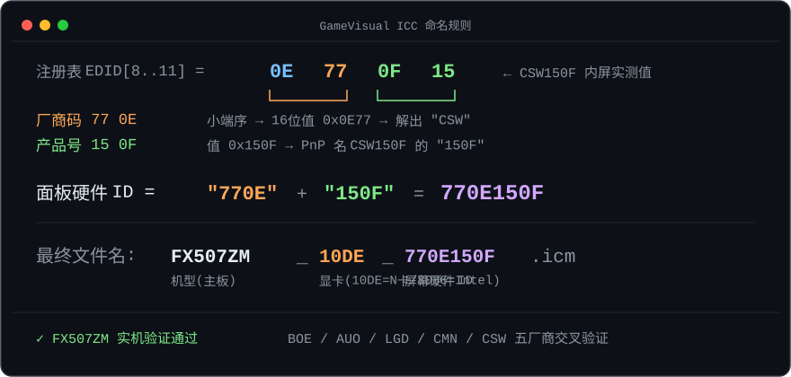
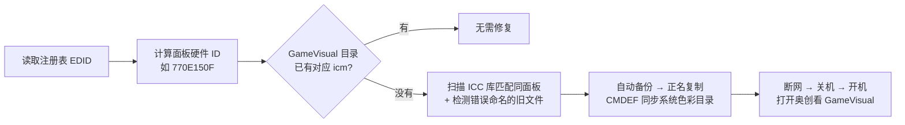
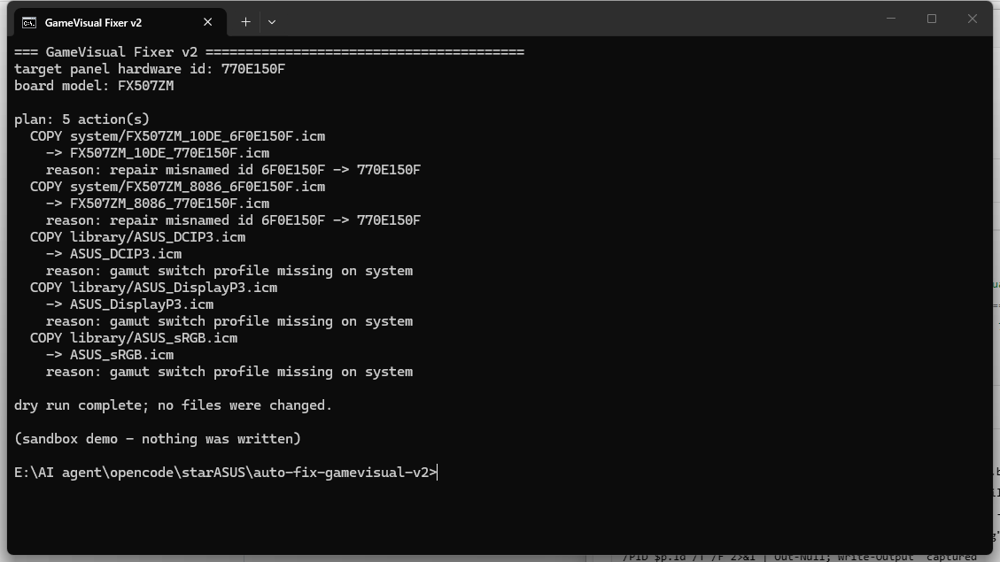
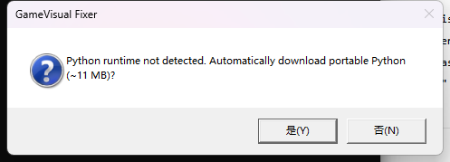
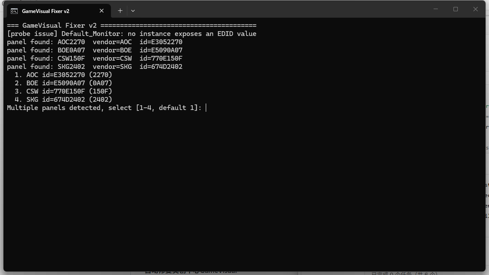

# Auto Fix GameVisual v2

修复华硕/ROG 机型**更换屏幕后，奥创中心（Armoury Crate）GameVisual 色彩模式失效**的工具。

一键运行，自动完成一切：没有 Python 环境？自动弹窗询问并下载便携版安装。检测屏幕 EDID、计算正确文件名、备份并修复 ICC 配置文件，全程无需管理员权限手动操作。

## 原理

奥创中心的 GameVisual 按 `{机型}_{显卡}_{屏幕硬件ID}.icm` 的命名在 `C:\ProgramData\ASUS\GameVisual\` 寻找色彩配置文件。换屏后新面板的硬件 ID 没有对应文件，校验失败，功能被禁用。

本工具直接从注册表读取屏幕 EDID，**精确计算出**正确的文件名：

```
文件名硬件ID = hex(EDID[9]) hex(EDID[8]) hex(EDID[11]) hex(EDID[10])
```

<p align="center">
  
</p>

整个修复流程：



运行效果（沙箱演示，识别机型与面板 → 生成修复计划）：

<p align="center">
  
</p>

该规则已用五家面板厂商的真实数据交叉验证：

| 厂商 | EDID[8..11] | 计算出的 ID |
|---|---|---|
| CSW | `0E 77 0F 15` | `770E150F` |
| BOE | `09 E5 07 0A` | `E5090A07` |
| AUO | `06 AF A2 D2` | `AF06D2A2` |
| LGD | `30 E4 63 05` | `E4300563` |
| CMN | `0D AE 3C 15` | `AE0D153C` |

### 相比 v1 的改进

| 问题 | v1 (AutoFixGameVisual) | v2 |
|---|---|---|
| 面板匹配 | 文件名子串模糊匹配，会误判 | 注册表 EDID 精确计算硬件 ID |
| 错误命名的历史文件 | 无能为力 | 自动检测并生成正名副本 |
| 单显示器电脑 | `Win32_DesktopMonitor()[1]` 直接崩溃 | 遍历注册表，天然免疫 |
| Python 环境 | 需自行安装 + pip 装 wmi | 弹窗引导自动装便携版，零依赖纯标准库 |
| 权限 | 直接失败 | 自动请求 UAC 提权 |
| 数据安全 | 无备份 | 修改前自动完整备份 |

## 使用方法

**推荐**：双击 `run_fix.bat`，跟着提示走。

没有 Python 环境时会弹窗询问，同意后自动下载便携版（免管理员）：

<p align="center">
  
</p>

如果接了多个显示器，程序会列出所有面板的硬件 ID 供你选择（笔记本内屏通常是不带外接品牌的那项）：

<p align="center">
  
</p>

或者命令行：

```
python fix_gamevisual.py            # 交互模式
python fix_gamevisual.py --dry-run  # 只看计划不改文件
python fix_gamevisual.py --yes      # 跳过确认
python fix_gamevisual.py --model FX507ZM --panel-hwid 770E150F   # 手动指定
```

| 参数 | 说明 |
|---|---|
| `--dry-run` | 只显示将要做的操作，不写任何文件 |
| `--yes` | 跳过确认提示 |
| `--library <目录>` | 自定义 ICC 库目录（默认本仓库 `color/`） |
| `--model <代码>` | 手动指定机型代码 |
| `--panel-hwid <8位>` | 手动指定面板硬件 ID |

## 修复成功后必做

> **断网 → 关机 → 开机 → 再打开奥创中心看 GameVisual**

断网是为了防止奥创联网重新下载官方 ICC 包覆盖本地文件（官方包里没有你的新面板）。确认可用后再联网观察；若联网后又失效，使用 GameVisual 前先断网即可。

修复成功后奥创中心的 GameVisual 恢复正常切换色彩模式：

<!-- 效果图占位: 截图奥创中心 GameVisual 页面保存为 docs/images/gamevisual-ok.png 后取消下行注释 -->
<!-- <p align="center"></p> -->

## 找不到我的面板怎么办？

仓库 `color/` 是社区共享的 ICC 库，`compressed/` 里还有按机型打包的压缩包。如果都没有你的面板 ID：

1. 找一台同款屏幕、GameVisual 正常的机器，把它的 icm 文件提交到上游项目；
2. 或者在 Windows「颜色管理」里手动给屏幕关联任意近似 ICC 应急。

## 常见问题

**Q: 会弄坏我的系统吗？**
修改仅限于向 `C:\ProgramData\ASUS\GameVisual\` 复制 .icm 文件和创建备份目录，不删除、不修改任何现有文件。每次运行前自动备份到 `C:\ProgramData\ASUS\GameVisual_backup_时间戳\`。

**Q: 弹窗说下载便携版 Python，安全吗？**
来自 python.org 官方的嵌入式发行版（国内自动走华为云/npmmirror 镜像加速），解压在本仓库 `_python\` 文件夹内，不写注册表、不需要管理员、可随时删除。

**Q: 为什么我这里检测出好几个面板？**
你接了外接显示器。选你笔记本内屏对应的那个（通常是不带外接品牌的那项），不确定就逐个试。

## 致谢与许可

- 原始项目与思路：[vanted7580/AutoFixGameVisual](https://github.com/vanted7580/AutoFixGameVisual)（作者 @VANTED）
- ICC 文件库贡献者：Gannod-Kitkut (FX507VV)、syh (GA503RM)、Chen-Mengze (FA507RM/G614JVR)、Akafusu_Rain (G733Z/G533Z/FA506QR) 等
- 本项目是上游项目的衍生作品，遵循 **GPL-3.0** 协议开源，ICC 文件版权归原作者所有

## 免责声明

本项目按"现状"提供，使用前请阅读代码或先用 `--dry-run` 预览。因使用本工具产生的任何问题由使用者自行承担。
