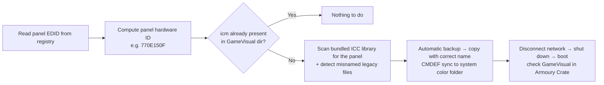
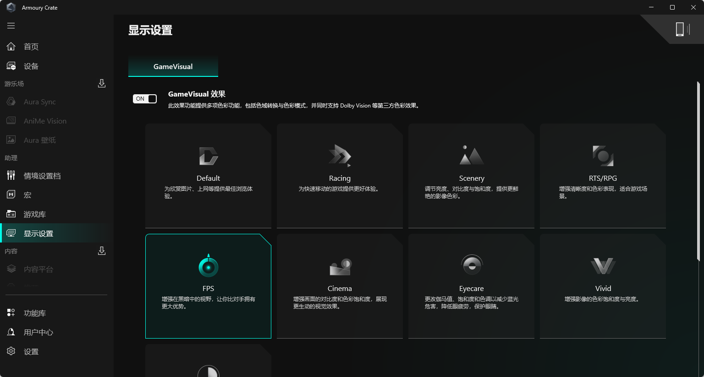

# Auto Fix GameVisual v2

[简体中文](README.md) | **English** | [日本語](README_JA.md)

A tool that fixes **GameVisual color modes becoming unavailable in ASUS Armoury Crate after a screen replacement** on ASUS / ROG / TUF laptops.

One double-click runs everything automatically: no Python installed? A dialog offers to fetch a portable build for you. The tool reads your panel's EDID from the registry, computes the correct ICC filename, backs up, and repairs the ICC profiles — no manual administrator work needed.

> Note: the tool's console output is in Chinese (it is built mainly for Chinese users). The flow is fully automatic, so in most cases you never need to type anything. Screenshots show the Chinese UI.

## How it works

Armoury Crate looks for GameVisual color profiles in `C:\ProgramData\ASUS\GameVisual\` under strict names: `{model}_{gpu}_{panel-hwid}.icm`. After a screen swap, the new panel's hardware ID has no matching file, validation fails, and the feature gets disabled.

This tool reads the panel EDID straight from the registry and **computes the exact filename**:

```
filename_hwid = hex(EDID[9]) hex(EDID[8]) hex(EDID[11]) hex(EDID[10])
```

<p align="center">
  
</p>

The full repair flow:



Sample run (sandbox demo: detect model & panel → build a repair plan):

<p align="center">
  
</p>

This rule has been cross-verified against real data from five panel vendors, plus vendor codes verified by earlier contributors in the ICC library:

| Vendor | EDID[8..11] | Computed ID | Filename prefix |
|---|---|---|---|
| BOE | `09 E5 07 0A` | `E5090A07` | `E509` |
| LG Display (LGD) | `30 E4 63 05` | `E4300563` | `E430` |
| AU Optronics (AUO) | `06 AF A2 D2` | `AF06D2A2` | `AF06` |
| Innolux | `0D AE 3C 15` | `AE0D153C` | `AE0D` |
| Sharp (SHP) | `4D 10 59 15` | `104D1559` | `104D` |
| Tianma (TMX) | `51 B8 61 15` | `B8511561` | `B851` |
| China Star Optoelectronics (CSO registration) | `0E 6F 0F 15` | `6F0E150F` | `6F0E` |

> Notes:
> - Data provenance: the **CSW entry comes from a live EDID measurement** (the author's own machine, accepted by Armoury Crate in practice); **all other rows were reverse-derived from real ICC filenames** — BOE / E430 / AF06 / AE0D / 104D / B851 come from the community `color/` library, and 6F0E comes from ASUS's official ICM package (shipped with the FX507ZM). The formula is bijective; every reverse-derived value matches the original filename exactly.
> - In the EDID a vendor is 3 letters (e.g. Sharp = SHP); in ICC filenames it is a 4-hex-digit prefix (e.g. 104D). The "Filename prefix" column is the fastest thing to look for when browsing `color/`.
> - Fun fact: China Star Optoelectronics uses multiple EDID registrations — CSO (filename prefix 6F0E) and CSW (prefix 770E). The official FX507ZM package ships the CSO-coded `6F0E150F`; the author's replacement panel is CSW-coded, so even with the same product code only `770E150F` gets accepted. One letter off and Armoury Crate refuses — that is exactly why computing from the EDID matters.

### Improvements over v1

| Problem | v1 (AutoFixGameVisual) | v2 |
|---|---|---|
| Panel matching | filename substring guessing, misfires | exact hardware ID computed from the registry EDID |
| Misnamed legacy files | helpless | auto-detected; correctly-named copies created |
| Single-display PCs | `Win32_DesktopMonitor()[1]` crashes outright | walks the registry, immune by design |
| Python environment | manual install + pip wmi | guided portable install via popup, standard library only |
| Privileges | fails outright | automatic UAC elevation |
| Data safety | no backup | full automatic backup before any change |

## Tutorial (beginner version)

### Step 1: Download

Open the **Releases** page of this repo (or go straight to `https://github.com/star-Cosmo/auto-fix-rog-gamevisual-v2/releases/latest`), download the zip from Assets, and **extract it fully** (right-click → Extract All) into any folder.

> Do not run from inside the zip! Extract first.

### Step 2: Double-click `run_fix.bat`

In the extracted folder, find `run_fix.bat` and double-click it. Then:

1. No Python? A dialog asks whether to download a portable build automatically (~11 MB, no admin required) — click Yes and wait:

<p align="center">
  
</p>

2. The tool auto-detects your model and panel, builds the repair plan, and **applies it automatically**
3. A UAC prompt appears (asking permission to modify) → click Yes
4. When you see the big "修复完成!" (repair complete) banner, you are done. A **full backup is saved first** to `C:\ProgramData\ASUS\GameVisual_backup_<timestamp>\` — restore anytime

Multiple displays: the tool auto-identifies the laptop's internal panel; if it cannot decide, it lists all panels and asks for a number (pick the entry without an external monitor brand).

Sample run (detect model & panel → repair plan):

<p align="center">
  
</p>

### Step 3: Disconnect network → shut down → boot (skip it and the fix gets undone!)

1. **Disconnect** (Wi-Fi off / unplug the cable)
2. **Shut down** completely (not a reboot)
3. Boot, open Armoury Crate → Display → GameVisual

If the color modes light up and switch freely, you are done (real screenshot):

<p align="center">
  
</p>

> **Why offline?** When Armoury Crate considers the local files "invalid", it re-downloads the official ICC package over the network and overwrites your files — and the official package does not contain your new panel. Offline, it reads the local files. After confirming everything works, reconnect; if it breaks again later, go offline before using GameVisual.

<details>
<summary><b>CLI advanced usage (regular users can ignore this)</b></summary>

```text
python fix_gamevisual.py --dry-run   # plan only, changes nothing
python fix_gamevisual.py --ask       # ask before applying (auto-apply by default)
python fix_gamevisual.py --model FX507ZM --panel-hwid 770E150F   # manual override
```

| Flag | Meaning |
|---|---|
| `--dry-run` | show planned actions, write nothing |
| `--ask` | ask for confirmation before applying (default: auto) |
| `--library <dir>` | custom ICC library folder (default: repo `color/`) |
| `--model <code>` | override model code |
| `--panel-hwid <8 hex digits>` | override panel hardware ID |

</details>

## Can't find your panel?

The repo's `color/` folder is a community-shared ICC library (**free to take from**); `compressed/` has per-model archives. If neither has your panel ID:

1. In Windows "Color Management", associate any close-enough ICC with your screen as a stopgap;
2. Or extract the ICC from a same-panel ASUS machine where GameVisual works, and contribute it here (next section).

## Contribute your ICC files (welcome!)

The upstream project [vanted7580/AutoFixGameVisual](https://github.com/vanted7580/AutoFixGameVisual) has been archived read-only; **this repo carries on the ICC sharing**: everything in `color/` is free to take, and every contributed file helps the next screen-swap victim.

**How to extract**: on an ASUS machine where GameVisual works, look for `.icm` files starting with the model name in:

```
C:\ProgramData\ASUS\GameVisual\
C:\Windows\System32\spool\drivers\color\
```

Filename format: `model_gpu_panelid[_CMDEF].icm`, e.g. `FX507ZM_10DE_770E150F.icm`.

**How to submit**: fork this repo → drop the icm into `color/` → open a PR; if Git is not your thing, open an Issue with the file attached (there is a dedicated ICC-contribution template).

## FAQ

**Q: Can this break my system?**
Changes are limited to copying .icm files into `C:\ProgramData\ASUS\GameVisual\` and creating a backup folder. Nothing is deleted or modified; every run backs up to `C:\ProgramData\ASUS\GameVisual_backup_<timestamp>\` first.

**Q: A popup wants to download a portable Python — is that safe?**
It is the official python.org embeddable build (Huawei Cloud / npmmirror mirrors are used automatically in mainland China), unpacked into this repo's `_python\` folder. No registry writes, no admin rights, delete it anytime.

**Q: Why are several panels detected?**
You have external monitors plugged in. The tool usually auto-picks the internal panel; otherwise pick the entry without an external brand (AOC / Dell / Samsung / ...).

## Feedback

Questions, suggestions, bugs:

- **Email**: chenbin2004sz@163.com (preferred)
- **GitHub Issues**: include your model, panel model/hardware ID, and a screenshot of the output

I reply as soon as I can.

## Acknowledgments & License

- Original idea & project: [vanted7580/AutoFixGameVisual](https://github.com/vanted7580/AutoFixGameVisual) (by @VANTED, archived read-only; this repo continues the ICC sharing)
- ICC library contributors: Gannod-Kitkut (FX507VV), syh (GA503RM), Chen-Mengze (FA507RM/G614JVR), Akafusu_Rain (G733Z/G533Z/FA506QR), and others
- This project is a derivative work licensed under **GPL-3.0**; ICC files remain the property of their original owners

## Disclaimer

Provided "as is". Read the code or preview with `--dry-run` before using. Any consequence of using this tool is on the user.
