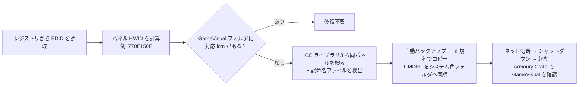

# Auto Fix GameVisual v2

[简体中文](README.md) | [English](README_EN.md) | **日本語**

ASUS / ROG / TUF ノートPCで**画面交換後に Armoury Crate の GameVisual カラーモードが使えなくなる**問題を修復するツールです。

ダブルクリック一つで自動実行：Python が未導入ならポップアップでポータブル版の導入を案内。レジストリからパネルの EDID を読み取り、正しい ICC ファイル名を計算し、バックアップしてから修復します。管理者権限の手動操作は不要です。

> 注意：ツールのコンソール出力は中国語です（中国のユーザー向け）。フローは完全自動のため、ほとんどの場合キーボード入力は不要です。スクリーンショットは中国語 UI です。

## 仕組み

Armoury Crate は `C:\ProgramData\ASUS\GameVisual\` 内の `{モデル}_{GPU}_{パネルHWID}.icm` という厳格な命名でプロファイルを探します。画面交換後、新しいパネルのハードウェア ID に対応するファイルが存在せず、検証に失敗して機能が無効化されます。

本ツールはレジストリから EDID を直接読み取り、**正確なファイル名を計算**します：

```
filename_hwid = hex(EDID[9]) hex(EDID[8]) hex(EDID[11]) hex(EDID[10])
```

<p align="center">
  
</p>

修復フロー全体：



実行サンプル（サンドボックスでのデモ：機種とパネルを認識 → 修復プランを生成）：

<p align="center">
  
</p>

このルールは 5 社のパネルメーカーの実データでクロス検証済み。さらに ICC ライブラリ内で先人たちが検証済みのベンダーコードをまとめました：

| メーカー | EDID[8..11] | 計算結果 | ファイル名プレフィックス |
|---|---|---|---|
| BOE（京東方） | `09 E5 07 0A` | `E5090A07` | `E509` |
| LG Display（LGD） | `30 E4 63 05` | `E4300563` | `E430` |
| AU Optronics（AUO／友達光電） | `06 AF A2 D2` | `AF06D2A2` | `AF06` |
| Innolux（群創光電） | `0D AE 3C 15` | `AE0D153C` | `AE0D` |
| Sharp（SHP） | `4D 10 59 15` | `104D1559` | `104D` |
| Tianma（TMX／天馬） | `51 B8 61 15` | `B8511561` | `B851` |
| CSOT（華星光電・CSO 登録） | `0E 6F 0F 15` | `6F0E150F` | `6F0E` |

> 補足：
> - データの出所：**CSW は実機 EDID の実測値**（作者の機種で、Armoury Crate が実際に受理）；**その他の行は実在する ICC ファイル名からの逆算**です — BOE / E430 / AF06 / AE0D / 104D / B851 はコミュニティ `color/` ライブラリから、6F0E は ASUS 純正 ICM パッケージ（FX507ZM 同梱）から。式は可逆で、逆算結果は元のファイル名と完全一致します。
> - EDID ではベンダーは 3 文字（例：SHP）、ICC ファイル名では 4 桁の 16 進プレフィックス（例：104D）。`color/` を探すときはこのプレフィックスを見るのが最速です。
> - 小ネタ：華星光電は複数の EDID 登録コードを持ちます — CSO（プレフィックス 6F0E）と CSW（770E）。FX507ZM 純正パッケージは CSO の `6F0E150F`。作者の交換パネルは CSW で、製品コードが同じでも `770E150F` でなければ受理されません。1 文字違うだけでも拒否されます — それが「EDID からの正確な計算」の価値です。

### v1 からの改善点

| 問題 | v1 (AutoFixGameVisual) | v2 |
|---|---|---|
| パネル判定 | ファイル名の部分一致で誤判定 | レジストリ EDID から正確に計算 |
| 誤命名された旧ファイル | 対応不可 | 自動検出して正規名のコピーを作成 |
| 単一ディスプレイ機 | `Win32_DesktopMonitor()[1]` でクラッシュ | レジストリ走査により根本的に回避 |
| Python 環境 | 手動インストール + pip で wmi | ポップアップでポータブル版を自動案内、標準ライブラリのみ |
| 権限 | そのまま失敗 | UAC 昇格を自動要求 |
| データ保護 | バックアップなし | 変更前に自動フルバックアップ |

## 使い方（初心者向け手順）

### ステップ 1：ダウンロード

リポジトリ右側の **Releases** ページ（または `https://github.com/star-Cosmo/auto-fix-rog-gamevisual-v2/releases/latest`）を開き、Assets の zip をダウンロードして、**必ず展開**（右クリック → すべて展開）してから任意のフォルダーへ。

> zip を開いたまま実行しないでください！先に展開する。

### ステップ 2：`run_fix.bat` をダブルクリック

展開したフォルダー内の `run_fix.bat` をダブルクリック。その後：

1. Python が無い場合、ポータブル版（約 11MB、管理者不要）を自動ダウンロードするか尋ねるダイアログが出る → 「はい」で待機：

<p align="center">
  
</p>

2. 機種とパネルを自動検出し、修復プランを作成して**自動実行**
3. UAC ダイアログ（変更の許可を求める）が出たら「はい」
4. 「修复完成!」（修復完了）の大きな表示が出れば成功。実行前に `C:\ProgramData\ASUS\GameVisual_backup_<タイムスタンプ>\` へ**自動バックアップ**されるので、いつでも復元可能

外接モニター接続時：内蔵パネルを自動判定。判断できない場合はパネル一覧から番号を選択（外付けブランド無しの項目）。

実行サンプル（機種とパネルの認識 → 修復プラン）：

<p align="center">
  
</p>

### ステップ 3：ネット切断 → シャットダウン → 起動（省略すると元に戻されます！）

1. **ネット切断**（Wi-Fi オフ / ケーブルを抜く）
2. **シャットダウン**（再起動ではなく完全終了）
3. 起動後、Armoury Crate → ディスプレイ → GameVisual

カラーモードが点灯し自由に切り替えられれば成功（実機スクリーンショット）：

<p align="center">
  
</p>

> **なぜオフライン？** Armoury Crate はローカルファイルを「不正」と判断すると、ネット経由で公式 ICC パッケージを再ダウンロードして上書きします（公式パッケージに新しいパネルのファイルは無い）。オフラインならローカルファイルを読みます。動作確認後に再接続し、また無効化される場合は GameVisual 使用前に切断を。

<details>
<summary><b>CLI 上級者向け（通常は不要）</b></summary>

```text
python fix_gamevisual.py --dry-run   # プランのみ表示、変更なし
python fix_gamevisual.py --ask       # 実行前に確認（既定は自動実行）
python fix_gamevisual.py --model FX507ZM --panel-hwid 770E150F   # 手動指定
```

| オプション | 説明 |
|---|---|
| `--dry-run` | 予定操作のみ表示、書き込みなし |
| `--ask` | 実行前に確認を求める（既定は自動） |
| `--library <dir>` | ICC ライブラリの指定（既定：リポジトリ `color/`） |
| `--model <code>` | モデルコードを手動指定 |
| `--panel-hwid <8桁>` | パネル HWID を手動指定 |

</details>

## プロジェクト構成

チュートリアルが終わったら、プロジェクトの中身も紹介します（貢献したい方にも）：

```text
auto-fix-gamevisual-v2/
├── run_fix.bat              # 初心者向け入口：ダブルクリック（Python 環境を自動準備して修復開始）
├── fix_gamevisual.py        # CLI 入口（薄いランチャー、埋め込み Python にも対応）
├── gamevisual_fixer/        # コア Python パッケージ（標準ライブラリのみ、依存ゼロ）
│   ├── edid.py              #   EDID 解析：バイト列 → パネル HWID（核心の数式はここ）
│   ├── sysprobe.py          #   レジストリ調査：パネル / 機種 / 管理者権限 + UAC 昇格
│   ├── planner.py           #   修復プラン：検出結果からアクション一覧を生成（純粋関数）
│   ├── applier.py           #   プラン実行：まず完全バックアップ、その後コピー
│   ├── cli.py               #   対話 UI：中国語表示、引数解析、スマートパネル選択
│   └── __main__.py          #   python -m gamevisual_fixer 入口
├── color/                   # コミュニティ ICC ライブラリ：63 ファイル、自由に取得可・貢献歓迎
├── compressed/              # 機種別 ICC アーカイブ（17 機種）
├── tests/                   # pytest 単体テスト（EDID 数式 / プラン生成 / パネル選択）
├── docs/images/             # README 用のスクリーンショットと図
└── .github/                 # 行動規範 / 貢献ガイド / セキュリティ / Issue・PR テンプレート
```

設計は 4 層：**検出**（edid + sysprobe）→ **判断**（planner）→ **実行**（applier）→ **対話**（cli）。判断層はファイルシステムに触れない純粋関数なので、コアロジックは完全にオフラインでテスト可能。ICC ライブラリ（`color/`）はコードから完全に分離されており、ICC の貢献にコーディング知識は一切不要です。

## 自分のパネルが見つからないときは

リポジトリの `color/` はコミュニティ共有の ICC ライブラリ（**自由に取得可**）、`compressed/` には機種別アーカイブがあります。どちらにも自分のパネル ID がない場合：

1. Windows の「色の管理」で近い ICC を応急的に関連付ける；
2. または GameVisual が正常な同パネルの ASUS 機から ICC を抽出して、本リポジトリへ貢献（次の節）。

## ICC ファイルの貢献（歓迎！）

上流プロジェクト [vanted7580/AutoFixGameVisual](https://github.com/vanted7580/AutoFixGameVisual) はアーカイブ済み（読み取り専用）。**当リポジトリが ICC 共有を引き継いでいます**：`color/` のファイルは自由に取得可。あなたの ICC が次の画面交換ユーザーを助けます。

**抽出方法**：GameVisual が正常な ASUS 機で、機種名で始まる `.icm` を探す：

```
C:\ProgramData\ASUS\GameVisual\
C:\Windows\System32\spool\drivers\color\
```

命名形式：`モデル_GPU_パネルID[_CMDEF].icm`、例：`FX507ZM_10DE_770E150F.icm`。

**提出方法**：fork → `color/` に追加 → PR。Git が無ければ Issue に添付（「ICC 貢献」テンプレートあり）。

## FAQ

**Q: システムを壊しませんか？**
変更は `C:\ProgramData\ASUS\GameVisual\` への .icm コピーとバックアップフォルダ作成のみ。既存ファイルの削除・変更はありません。毎回実行前に `C:\ProgramData\ASUS\GameVisual_backup_<タイムスタンプ>\` へバックアップします。

**Q: ポータブル Python のダウンロードは安全？**
python.org 公式の embedded 版です（中国内は華為クラウド / npmmirror ミラーを自動使用）。リポジトリ内 `_python\` に展開。レジストリ書き込みなし、管理者不要、いつでも削除可。

**Q: 複数のパネルが検出されるのはなぜ？**
外接モニターが接続されています。通常は内蔵パネルを自動選択します。判断できない場合は、外付けブランド（AOC / Dell / Samsung など）無しの項目を選んでください。

## フィードバック

質問・提案・バグ報告：

- **メール**：chenbin2004sz@163.com（優先）
- **GitHub Issues**：機種・パネル型番 / ハードウェア ID・出力のスクリーンショットを添付

できるだけ早く返信します。

## 謝辞とライセンス

- オリジナルの発想とプロジェクト：[vanted7580/AutoFixGameVisual](https://github.com/vanted7580/AutoFixGameVisual)（作者 @VANTED、アーカイブ済み。当リポジトリが ICC 共有を引き継ぎ）
- ICC ライブラリ貢献者：Gannod-Kitkut (FX507VV)、syh (GA503RM)、Chen-Mengze (FA507RM/G614JVR)、Akafusu_Rain (G733Z/G533Z/FA506QR) ほか
- 本プロジェクトは **GPL-3.0** の派生作品です。ICC ファイルの著作権は元の所有者に帰属します

## 免責事項

本ツールは「現状有姿」で提供されます。使用前にコードを読むか `--dry-run` で確認してください。使用による一切の結果は利用者の責任となります。
